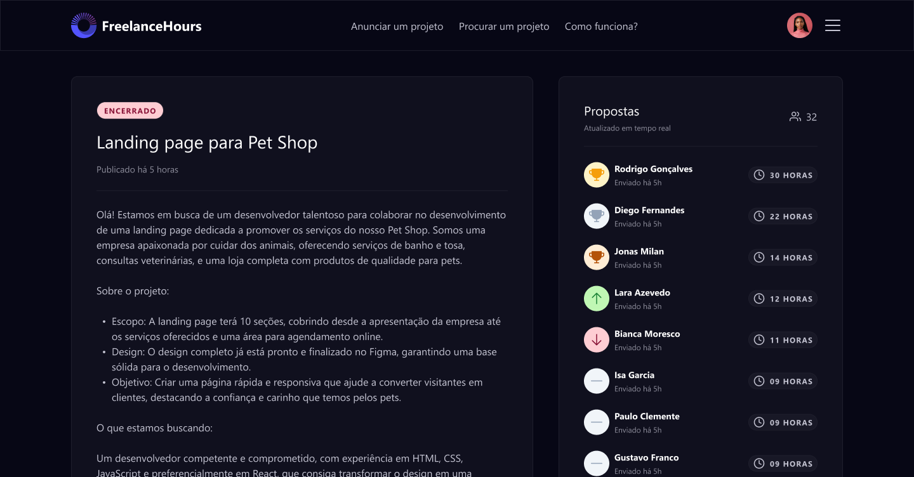

</a>

  
    

## Projeto FreelanceHours

FreelanceHours is an application developed in PHP, Laravel and Livewire where freelancers can submit proposals for hours that can contribute to a given project.

 

  

## Tecnologias utilizadas

- [**PHP**](https://www.php.net/)
- [**Laravel**](https://laravel.com/)
- [**Livewire**](https://laravel-livewire.com/)
- [**Tailwind**](https://tailwindcss.com/)